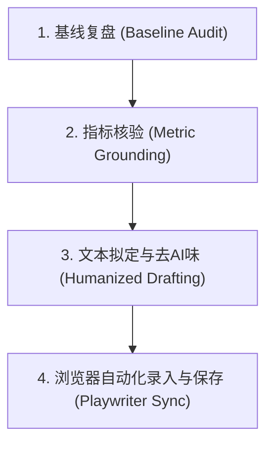

# HPM 季度绩效自评

用于大参林绩效管理系统（HPM）季度自评全流程：从历史基线与主管评价复盘出发，核验专题代码与数仓客观证据，撰写无 AI 腔调的务实文本，并通过 Playwriter 自动化录入表单草稿。

## 核心主导词 (Leading Words)

- **`grounded`（证据着陆）**：所有业务成果与指标数据必须从仓库专题（`topics/*`）、交付文档或数仓执行日志中提取，严禁臆造数字。
- **`humanized`（去 AI 味）**：剔除“赋能、筑牢、多点开花、立体升维”等虚浮套话，采用一线资深数据分析专家的务实工程叙事。
- **`no-prefix`（严禁档位前缀）**：页面下拉框已选择档位与系数，文本框内**严禁重复写入**“`1档（系数：1）`”或“`1.25档`”，直接填写纯事实内容。
- **`popover-gate`（弹窗录入门禁）**：定性指标文本框为只读，必须模拟点击唤出 `.el-popover` 弹窗并在其内部文本域输入，触发 `input` 与 `change` 事件后点击确定。
- **`draft-only`（仅存草稿）**：全自动流程仅允许触发【保存】动作，严禁点击【提交】，最终提交权保留给员工本人。

---

## 信息架构与关联指引

```text
skills/hpm-performance-review/
├── SKILL.md                          # 核心执行流程、质量门禁与状态机
├── references/
│   ├── criteria.md                   # 评分分值体系、通用力六大维度官方考核要点与字符规范
│   └── metrics_lineage.md            # 商品策略专题资产到 HPM 责任书指标的血缘映射矩阵
├── examples/
│   ├── q2_baseline.md                # Q2 自评、评分与主管综合评价真实底稿与复盘
│   ├── q3_showcase.md                # Q3 终审标准范文（责任书关键任务 + 6个通用力 + 四新复盘）
│   └── anti_patterns.md              # 常见写作反模式对比（AI 假大空、重复前缀、数据无凭据）
└── scripts/
    └── hpm_browser_sync.js           # Playwriter 自动化巡检、弹窗录入与保存脚本模板
```

---

## 4 步执行流程



### 第 1 步：基线复盘 (Baseline Audit)

1. **读取前序季度档案**：
   - 查阅前序季度（如 Q2）的自评得分、主管（第一/第二评估人）打分与文字反馈（参考 `examples/q2_baseline.md`）。
2. **提取期望与提升项**：
   - 识别主管指出的机会点（例如：加强项目跨团队组织统筹能力、提升自身专业影响力）。
   - 本期自评的“待提升点”与“新成长”必须与主管期望形成跨季度的闭环呼应。
3. **完成标准**：
   - 明确本期各指标的目标分值策略（如突破项冲 1.25，常规项保 1.0）及主管期望承接点。

### 第 2 步：指标核验 (Metric Grounding)

1. **专题事实提取**：
   - 对照绩效责任书中的指标项，检索对应专题仓库证据链（参考 `references/metrics_lineage.md`）：
     - 门店智能组货：`topics/smart_assortment/`、`topics/new_store/`（动销率、销售/毛利占比、新店试点数）。
     - 缩铺与退清：`topics/non_catalogue_clear/`（降本金额、店品数下降、库存数量）。
     - O2O 重点店/中心店：`topics/o2o_store/`（蜂窝品、美团/淘闪 TOP2500 落地情况）。
     - 自动陈列：`topics/auto_display/`（清远/阳江试点与全面推广米效）。
     - 数据 Agent：`商品决策 Agent` 工具层与核心层容器化状态。
2. **数仓与代码校验**：
   - 杜绝口算估算；对关键指标差值与变动率核对 SQL 或交付 Markdown 记录。
3. **完成标准**：
   - 所有写入完成说明的数值、日期、省区、店数均有直接的文件或数据凭据。

### 第 3 步：文本拟定与去AI味 (Humanized Drafting)

1. **责任书定性指标（3.1 ~ 3.6）拟定**：
   - 对标 `references/criteria.md` 考核说明，每项逐一回应官方要求（如零低级错误、知识沉淀篇数、响应时效、技术应用、提效百分比）。
   - **执行 `no-prefix` 规则**：删除所有“`1档（系数：1）`”等前缀。
2. **综合评价“四新”复盘拟定**：
   - **新业绩**：本期取得的新业务突破（列举经过验证的具体数字）。
   - **新贡献**：对业务大盘与部门建立的标准机制、方法论或自动化工具。
   - **新创新**：算法应用、工程架构或业务模式维度的首创突破。
   - **新成长**：业务全流程认知深化、架构工程能力沉淀、跨团队统筹推进行动力。
3. **综合评价“待提升点”拟定**：
   - 提出 3~4 条下季度可落地、可衡量的攻坚方向（规模化推广、业务场景融入、协同机制长效化、文档指引沉淀）。
4. **运行 `humanizer-zh` 语言审计**：
   - 检查并删除：空洞连接词（此外、值得注意的是）、浮夸比喻（护城河、织锦）、过度排比与破折号。
   - 保持短句，长短交错，使用第一人称与工程师平实语气。
5. **完成标准**：
   - 责任书定性文本各 150~250 字；复盘和总结 600~800 字；待提升点 200~350 字；字数严格控制在 1000 字符限制内，无 Markdown 加粗标记。

### 第 4 步：浏览器自动化录入与保存 (Playwriter Sync)

1. **连接与定位**：
   - 启动 Playwriter 会话，连接至用户打开的 HPM 标签页：
     `playwriter session new`
   - 核对当前页面是否处于目标季度的责任书编辑页面（确认含有【保存】按钮）。
2. **批量录入与弹窗处理**：
   - 下拉框选择：点击 `.el-select` 并选取目标档位（如 `1档(系数：1)`）。
   - 只读文本域录入（定性指标）：
     - 点击只读 `textarea` 唤出 `.el-popover`。
     - 填入人性化纯文本内容。
     - 点击弹窗内的【确认】按钮关闭弹窗。
   - 综合评价录入：
     - 点击 `#tab-selfEvaluation` 切换标签页。
     - 填入“复盘和总结”与“待提升点（机会点）”文本域，触发 `input` 与 `change` 事件。
3. **草稿保存与校验**：
   - 点击顶部操作栏的【保存】按钮。
   - 监听 `.el-message`，确认返回包含 `保存成功！`。
   - 截图或读取文本核对自评当前得分（如 `1.08`）。
4. **清理会话**：
   - 销毁 Playwriter 会话，释放浏览器控制权。
5. **完成标准**：
   - 页面提示保存成功，表单所有项目完整无遗漏，未触发提交。

---

## 质量门禁 (Quality Gates)

| 门禁项 | 判定条件 | 违规处理 |
|---|---|---|
| **真实性门禁** | 所有填报数字与事实在 `topics/*` 或数仓中可溯源 | 拦截并退回核验，禁止填报未证实数据 |
| **前缀门禁** | 文本框内不得包含 `1档`、`系数：1` 等冗余字符 | 自动化前置正则清洗：`^([0-9\.]+档.*?[\)）]\s*)` |
| **纯文本门禁** | 不得包含 `**`、`##`、`<div>`、表情符号等修饰符 | 纯文本清洗，保留标准中文标点与换行分点 |
| **字数门禁** | 单个多行文本框字符数必须 $\le 1000$ | 超过时裁剪铺垫修辞，保留核心事实与数字 |
| **安全门禁** | 仅调用【保存】操作，严禁调用【提交】按钮 | 脚本中写死定位器为 `button:has-text("保存")` |
